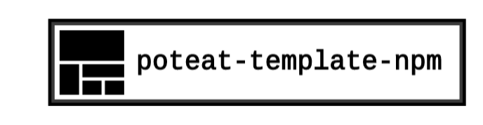

> A personal template library for NodeJS Typescript npm projects.

---

## Usage

Clone from Github:

```sh
git clone git@github.com:poteat/poteat-template-npm.git
```

Then replace the necessary items in `package.json` for the particular project.
